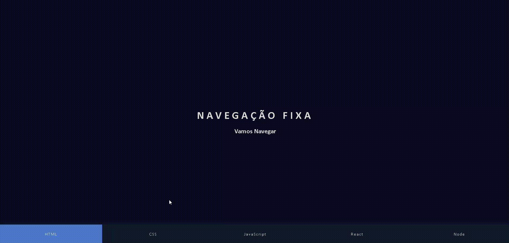

# 📌 Menu de Navegação Fixo e Interativo  

Um **menu de navegação fixo** desenvolvido com **HTML, CSS e JavaScript**.  
O projeto mantém a barra de navegação visível mesmo ao rolar a página e destaca automaticamente a **seção ativa** com animações suaves.  

  

---

## 🚀 Tecnologias Utilizadas  

- 🌐 **HTML5** → Estrutura da página e seções  
- 🎨 **CSS3** → Estilização, layout responsivo e animações  
- ⚡ **JavaScript** → Interatividade, rolagem suave e destaque da seção ativa  

---

## 🎯 Funcionalidades  

✅ Menu fixo que se adapta ao rolar a página  
✅ Destaque automático do link da seção ativa  
✅ Rolagem suave ao clicar nos links  
✅ Layout moderno, responsivo e elegante  

---

## 📂 Estrutura do Projeto  

```bash
📁 menu-navegacao-fixo
├── index.html       # Estrutura HTML
├── style.css        # Estilização e design responsivo
├── script.js        # Interatividade do menu e seções
├── assets/
│   └── animation.gif     # Demonstração animada do menu
└── README.md        # Documentação
